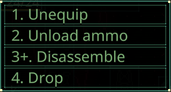

# Quasimorph Context Menu Hotkeys



# Info
Adds hotkeys to the context menus.

Ex: Pressing the 1 key for "1. Unequip" will unequip the item.
Ex: Pressing Alt+3 for the "3+. Disassemble" will disassemble the item.

The keys default to 0-9, and modifiers to Shift or Alt.  Can be customized in the configuration.

## Modifier Keys
Any command with a '+' requires holding down an alt or shift key to activate.
This is to safeguard against accidentally invoking disassembly commands.

The modifier keys (shift, alt, etc.) and the list of commands that require a modifier key can be configured.

# Configuration
The configuration file is located at ```%UserProfile%\AppData\LocalLow\Magnum Scriptum Ltd\Quasimorph\QM_ContextMenuHotkeys.json```.
The file will be created the first time the game is run.


## Settings
Note: if the config file does not have all of the settings below, delete the file.  When the game is next run, a new config file with all options will be created.

|Name|Default|Description|
|--|--|--|
|CommandX|0-9|The activation key that matches the number.  Ex: 1. Disassemble uses the 1 key.
|ModifierCommands|Disassemble*, UnlockDataDisk|The list of commands to require a modifier key to be held.  Ex: Alt + 1.  See the Command List section below |
|ModifierKeys|Shift, Alt|The modifier keys for the ModifierCommands|

## Key List
The list of valid keyboard keys can be found  at the bottom of https://docs.unity3d.com/ScriptReference/KeyCode.html

# Command List

The game currently supports the following commands for the Context Menu.

```
Drop
Take
Equip
Unequip
Use
Reload
UnloadAmmo
Eat
FixWound
Amputate
Disassemble
DisassembleAll
DisassembleX1
Repair
SplitStacks
SplitStacksConfirm
UnlockDatadisk
SpillOnTheFloorX1
SpillOnTheFloorX5
ApplySkull
RemoveSkull
RemoveFire
```

# Source Code
Source code is available on GitHub https://github.com/NBKRedSpy/QM-ContextMenuHotkeys

# Change Log
## 2.0.0

* Added list for commands that must have a modifier.  Defaults to destructive items.

* Improved the command parsing.  Now avoids invisible cached commands.


