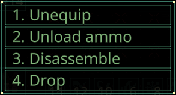

# Quasimorph Context Menu Hotkeys



# Info
Adds hotkeys to the context menus.
The keys default to 0-9, but can be  configured.

# Configuration
The configuration file is located at ```%UserProfile%\AppData\LocalLow\Magnum Scriptum Ltd\Quasimorph\QM_ContextMenuHotkeys.json```.
The file will be created the first time the game is run.

The file will contain multiple Command\<number\> entries.  Each entry corresponds to the menu item hotkey from top to bottom.
Use the Unity Keycode values found here https://docs.unity3d.com/ScriptReference/KeyCode.html


# Source Code
Source code is available on GitHub https://github.com/NBKRedSpy/QM-ContextMenuHotkeys

