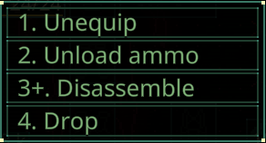

# Quasimorph Context Menu Hotkeys



# Info
Adds hotkeys to the context menus. 

Supports both command binding (Q = Unequip) and positional binding (second item is 2).

By default the command binding is enabled.

The key binds and the modes can be changed in the configuration file.

# Update For Existing Users

The latest update defaults to "command bind" mode instead of "both".
The configuration has been simplified and now includes all context menu commands in the configuration file.
The mod will automatically upgrade the existing configuration file to the latest version.

Use the new EnableNumberedMode and EnableCommandMode value to toggle each mode.  It is no longer required to modify the key binds to disable a mode.

# Positional Mode Modifier Keys
Any command with a '+' requires holding down the number key and the alt or shift key to activate.
This is to safeguard against accidentally invoking disassembly commands.

The modifier keys (shift, alt, etc.) and the list of commands that require a modifier key can be configured.


# Configuration

The configuration file is located at ```%UserProfile%\AppData\LocalLow\Magnum Scriptum Ltd\Quasimorph_ModConfigs\QM_ContextMenuHotkeys\QM_ContextMenuHotkeys.json```.
The file will be created the first time the game is run.

## Settings
Note: if the config file does not have all of the settings below, delete the file.  When the game is next run, a new config file with all options will be created.

|Name|Default|Description|
|--|--|--|
|ConfigVersion||Used internally|
|EnableNumberedMode|false|Set to true to enable the positional hotkeys.  Ex: 2 = second item|
|EnableCommandMode|true|Set to true to enable command binding hotkeys.  Ex:  D = Drop|
|CommandBinds|Key and Command (See config file)|The list of commands and their shortcut keys to invoke the command.  For example, D for Disassemble.  To not bind a command, set the Key to "None"|
|CommandN|0-9|Key bindings for the positional mode. Numbered from top to bottom.|
|ModifierKeys|Shift, Alt|Positional Mode only. The list of keys that count as a modifier.|


### Command Binding Duplicate Note
The Command Binding mode can use the same key for multiple entries.  For example, Disassembly and DiassemblyAll will not show up on the same menu and is safe to reuse the same key.

If the context menu has more than item with the same key bind, the first entry will be chosen.

## Key List
The list of valid keyboard keys can be found  at the bottom of https://docs.unity3d.com/ScriptReference/KeyCode.html

# Command List

The game currently supports the following commands for the Context Menu.

```
Drop
Take
Equip
Unequip
Use
Reload
UnloadAmmo
Eat
FixWound
Amputate
Disassemble
DisassembleAll
DisassembleX1
Repair
SplitStacks
SplitStacksConfirm
UnlockDatadisk
SpillOnTheFloorX1
SpillOnTheFloorX5
ApplySkull
RemoveSkull
RemoveFire
```

These command identifiers are used for both the Command binds as well as the commands that require a <number> + Modifier Key.

# Support
If you enjoy my mods and want to buy me a coffee, check out my [Ko-Fi](https://ko-fi.com/nbkredspy71915) page.
Thanks!

# Source Code
Source code is available on GitHub https://github.com/NBKRedSpy/QM-ContextMenuHotkeys

# Change Log

## 3.3.0
* Moved config file directory.

## 3.2.0
* .8 compatible.

## 3.1.0
* Simplified enabling modes with a single setting.
* Supports upgrading the configuration schema.
* Added every context menu command in the config with unbound items set to KeyCode.None.
* Highlights the hotkey on the menu items.

## 3.0.0
* Supports Command Binding.

## 2.0.0

* Added list for commands that must have a modifier.  Defaults to destructive items.

* Improved the command parsing.  Now avoids invisible cached commands.


