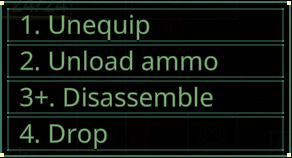

# Quasimorph Context Menu Hotkeys



# Info
Adds hotkeys to the context menus. 
The hotkeys can be configured in the config file noted below.

# Configuration

The configuration file is located at ```%UserProfile%\AppData\LocalLow\Magnum Scriptum Ltd\Quasimorph_ModConfigs\QM_ContextMenuHotkeys\QM_ContextMenuHotkeys.json```.
The file will be created the first time the game is run.

## Settings

|Name|Default|Description|
|--|--|--|
|ConfigVersion||Used internally|
|CommandBinds|Key and Command (See config file)|The list of commands and their shortcut keys to invoke the command.  For example, D for Disassemble.  To not bind a command, set the Key to "None"|

### Important - Divide Stacks 
The divide stacks and confirm commands are special in that they use a number.  Divide is 99999 and confirm is 100000.

### Command Binding Duplicate Note
The Command Binding mode can use the same key for multiple entries.  For example, Disassembly and DiassemblyAll will not show up on the same menu and is safe to reuse the same key.

If the context menu has more than item with the same key bind, the first entry will be chosen.

## Key List
The list of valid keyboard keys can be found  at the bottom of https://docs.unity3d.com/ScriptReference/KeyCode.html

# Command List

The game currently supports the following commands for the Context Menu.

```
    Drop,
    Take,
    Equip,
    Unequip,
    Use,
    Reload,
    UnloadAmmo,
    Eat,
    FixWound,
    Amputate,
    Disassemble,
    DisassembleAll,
    DisassembleX1,
    Repair,
    UnlockDatadisk,
    SpillOnTheFloorX1,
    SpillOnTheFloorX5,
    ApplySkull,
    RemoveSkull,
    RemoveFire,
    Take_To_Drag,
    Augment,
    RemoveAugmentation,
    Implant,
    RemoveImplants,
    99999,
    100000
```

Note: Commands 99,999 and 100,000 are "split stacks" and "split stacks confirm"

# Support
If you enjoy my mods and want to buy me a coffee, check out my [Ko-Fi](https://ko-fi.com/nbkredspy71915) page.
Thanks!

# Source Code
Source code is available on GitHub https://github.com/NBKRedSpy/QM-ContextMenuHotkeys

# Change Log
https://github.com/NBKRedSpy/QM-ContextMenuHotkeys/blob/master/CHANGELOG.md
