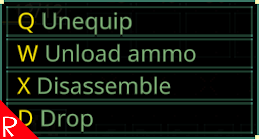

# Quasimorph Context Menu Hotkeys



# Info
Adds hotkeys to the context menus. 
The hotkeys can be configured in the config file noted below.

# Configuration

The configuration file is located at ```%UserProfile%\AppData\LocalLow\Magnum Scriptum Ltd\Quasimorph_ModConfigs\QM_ContextMenuHotkeys\QM_ContextMenuHotkeys.json```.
The file will be created the first time the game is run.

## Settings

|Name|Default|Description|
|--|--|--|
|ConfigVersion||Used internally|
|CommandBinds|Key and Command (See config file)|The list of commands and their shortcut keys to invoke the command.  For example, D for Disassemble.  To not bind a command, set the Key to "None"|

### Important - Divide Stacks
As of 0.8.6, the divide stacks command (aka split stacks internally) is now the value of 99999.
This is due to an internal change in the game.  Existing configs will have the SplitStacks value automatically updated to the number version.

### Command Binding Duplicate Note
The Command Binding mode can use the same key for multiple entries.  For example, Disassembly and DiassemblyAll will not show up on the same menu and is safe to reuse the same key.

If the context menu has more than item with the same key bind, the first entry will be chosen.

## Key List
The list of valid keyboard keys can be found  at the bottom of https://docs.unity3d.com/ScriptReference/KeyCode.html

# Command List

The game currently supports the following commands for the Context Menu.

```
Drop
Take
Equip
Unequip
Use
Reload
UnloadAmmo
Eat
FixWound
Amputate
Disassemble
DisassembleAll
DisassembleX1
Repair
UnlockDatadisk
SpillOnTheFloorX1
SpillOnTheFloorX5
99999
ApplySkull
RemoveSkull
RemoveFire
Take_To_Drag
Augment
RemoveAugmentation
Install
```

# Support
If you enjoy my mods and want to buy me a coffee, check out my [Ko-Fi](https://ko-fi.com/nbkredspy71915) page.
Thanks!

# Source Code
Source code is available on GitHub https://github.com/NBKRedSpy/QM-ContextMenuHotkeys

# Change Log
## 3.5.0
* v0.8.6 compatibility
* Removed positional mode.
* Configs will automatically be changed to write any missing settings from older files.

## 3.3.0
* v0.8.5 compatible.

## 3.3.0
* Moved config file directory.

## 3.2.0
* .8 compatible.

## 3.1.0
* Simplified enabling modes with a single setting.
* Supports upgrading the configuration schema.
* Added every context menu command in the config with unbound items set to KeyCode.None.
* Highlights the hotkey on the menu items.

## 3.0.0
* Supports Command Binding.

## 2.0.0

* Added list for commands that must have a modifier.  Defaults to destructive items.

* Improved the command parsing.  Now avoids invisible cached commands.


